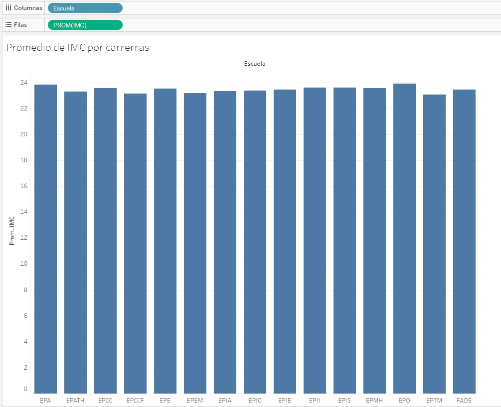
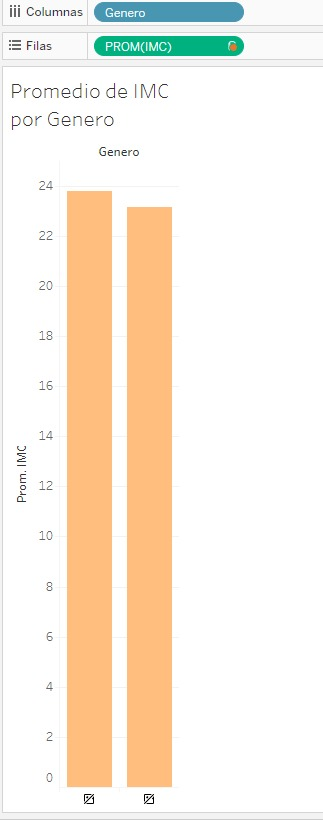
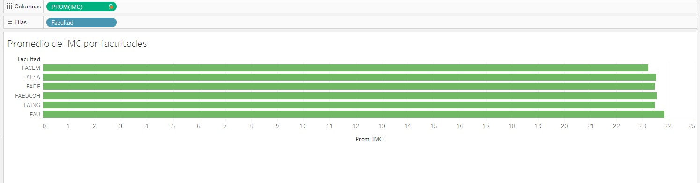

## Reportes en Tableau

| Imagen | Título |
|--------|--------|
|  | *Cantidad de estudiantes que acudieron a tópico por facultades* |
|  | *----* |
|  | *Promedio de IMC por carreras* |
|  | *Promedio de IMC por género* |
|  | *Promedio de IMC por facultades* |

